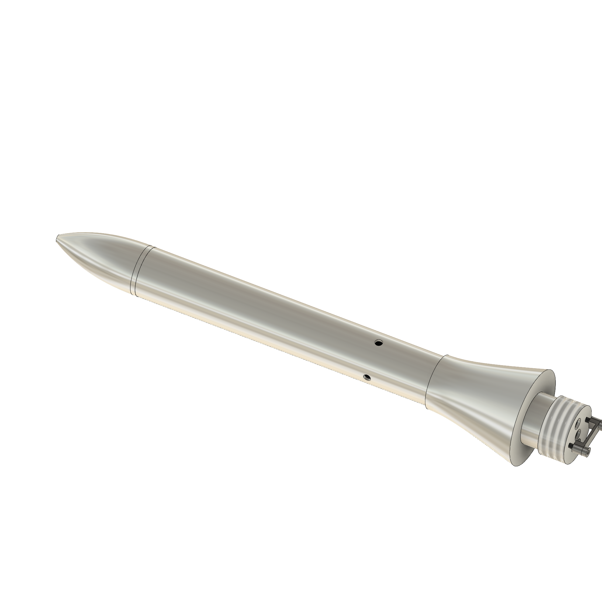

The CAD with step files and technical drawings can be found in the `CAD` folder.  

  

`PCB/PitotCTRLBoard` is the controller PCB with the MCU, IMU, ADC and SD-card on it  
`PCB/PitotPBoard3` is the sensor board containing the two Barometers  
The two boards are connected with 3V3, GND, and two I2C lines.  
Consult the `BOM.csv` to order the components, and `assembly_instructions.txt` to mount the hardware.  
`TODO.txt` contains a list of possible improvoments for future interations
