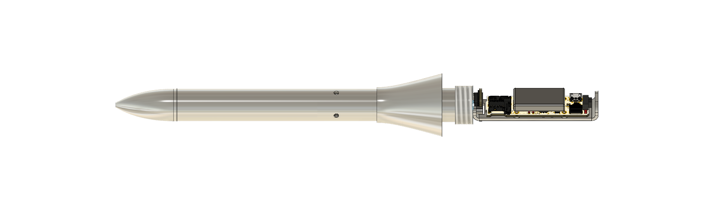
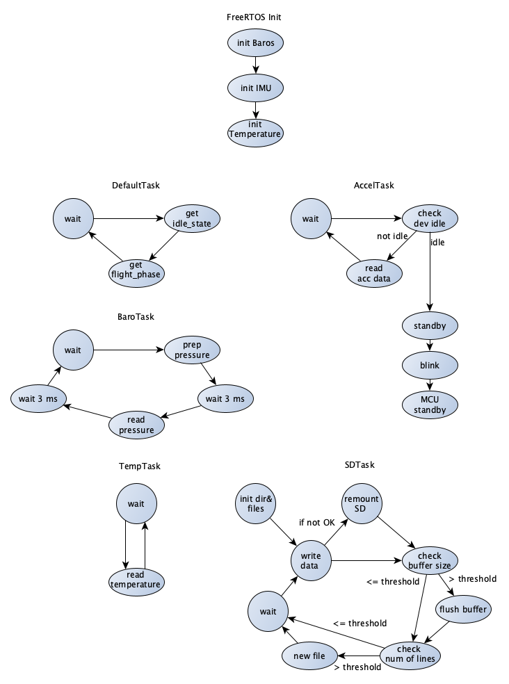

# ARIS Pitot Tube 

This pitot tube prototype is designed as an all-in-one plug-and-play system to gather data.  

  

The controller is based on an STM32F405 and mounted directly to the tube along with two MS5803 barometers, one MCP9600 thermocouple ADC, one ICM20601 accelerometer, an SD card and a battery.  
The software uses freeRTOS and will put the MCU in standby mode until the IMU wakes it up during lift-off (interrupt out of IMU to wakeup pin 1 on MCU).  
Below is a diagram explaining the software architecture.  

  

  
Repo structure:  
`Core/Inc` contains headers of project specific code  
`Core/Src` contains source of project specific code
